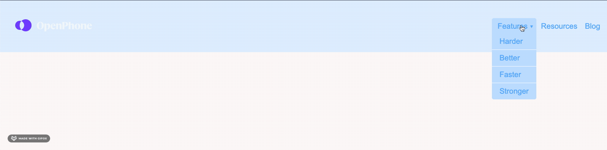

# Dropdown Menu
A submenu that reveals itself on hover.

## My Approach
This project was pretty straightforward, but I knew I needed more practice with positioned elements. I learned about `z-index`, which ties the whole topic together nicely. Some takeaways from this one:

- I wrapped the actual *Features* navigation item in a span because I didn't want it to behave like the other elements in the menu, which are anchors. I also had a specfic styling hook with span.
- The `z-index` property is ignored unless the box is a positioned element.
- By default, positioned elements appearing earlier in the source order *cannot* overlap elements declared later in the source order, whether those elements are positioned or not.
- Inversely, positioned elements appearing later in the source order *can* overlap elements declared earlier in the source order, whether those elements are positioned or not. All things being equal, the stacking context is determined by the source order.
- The stacking context can also be altered by the z-index. The higher the z-index of a positioned element, the further up in the stack it will appear, i.e. closer to the user. 
